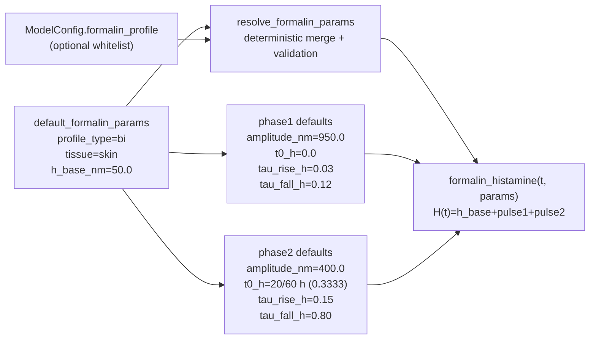

# E:\g-drive\05_AI\github\PKPD-model-for-XC7\docs\_plot_script_common.py  _plot_script_common.py

```python
from __future__ import annotations

import argparse
import sys
from pathlib import Path

import matplotlib

ROOT = Path(__file__).resolve().parents[1]
SRC = ROOT / "src"
DEFAULT_OUT_DIR = ROOT / "docs" / "figures"

if str(SRC) not in sys.path:
    sys.path.insert(0, str(SRC))
if str(ROOT) not in sys.path:
    sys.path.insert(0, str(ROOT))

matplotlib.use("Agg")

from pkpd_xc7.io import load_simulation_run
from pkpd_xc7.viz import ScenarioPlotSpec, plot_scenario_run_figures


def run_plot_script(spec: ScenarioPlotSpec, *, description: str) -> int:
    parser = argparse.ArgumentParser(description=description)
    parser.add_argument(
        "--run-dir",
        type=Path,
        required=True,
        help="Каталог с артефактами симуляции: simulation.csv и meta.yaml",
    )
    parser.add_argument(
        "--out-dir",
        type=Path,
        default=DEFAULT_OUT_DIR,
        help="Каталог для сохранения PNG фигур",
    )
    args = parser.parse_args()

    run = load_simulation_run(args.run_dir)
    artifacts = plot_scenario_run_figures(run, spec, out_dir=args.out_dir)

    print(f"Saved histamine figure: {artifacts.histamine_png}")
    print(f"Saved trafficking figure: {artifacts.receptor_png}")
    print(f"Saved G-signaling figure: {artifacts.g_signal_png}")
    return 0
```

# E:\g-drive\05_AI\github\PKPD-model-for-XC7\docs\assumptions_registry.md  assumptions_registry.md

```markdown
# Assumptions Registry

Реестр допущений проекта и их трассируемость.

| ID | Допущение | Основание/источник | Влияние | Статус |
|---|---|---|---|---|
| A-001 | Используется детерминированный расчёт при одинаковом конфиге | Поведение `simulate` + тесты на повторяемость | Воспроизводимость артефактов | Active |
| A-002 | `traceability.source_in_report` обязателен и не может быть пустым | Валидация схемы конфига | Базовая аудируемость источника | Active |
| A-003 | Если `report_v12_extracted` отсутствует, регрессия по marker tables не может быть полностью проверена | Регрессионный тест помечает случай как xfail | Риск неполной валидации against report | Active (Blocked by data) |
| A-004 | Для отсутствующего `profile_id` временно используется `model_id` как surrogate-id | Поле `profile_id` отсутствует в текущем schema | Единообразие ссылок в документации | Active (Blocked by data) |
| A-005 | Сравнение в `validate` числовых колонок выполняется с допуском `1e-9` | Реализация функции validate | Строгая числовая проверка | Active |
| A-006 | В фазе 7 визуализации для всех тканей временно используется одна глобальная `constitutive_activity` из `meta.yaml -> trafficking_params` | Текущая схема `TraffickingConfig` хранит только одно глобальное значение CA; тканеспецифичная CA legacy-скриптов не переносится без рефакторинга ядра | Сопоставимость новых графиков с артефактами прогона; ограничение на межтканевую интерпретацию базальной активности | Active |

## Правило фиксации блокеров

Если допущение невозможно подтвердить без данных отчёта v12, помечать как **Blocked by data** и не добавлять новые технические механизмы обхода.
```

# E:\g-drive\05_AI\github\PKPD-model-for-XC7\docs\build_figures_docx.py  build_figures_docx.py

```python
from __future__ import annotations

import argparse
import json
import os
import re
import sys
import tempfile
import zipfile
from dataclasses import dataclass
from pathlib import Path
from typing import Any
from xml.sax.saxutils import escape

ROOT = Path(__file__).resolve().parents[1]
DOCS_DIR = ROOT / "docs"
SRC = ROOT / "src"
DEFAULT_FIGURES_DIR = DOCS_DIR / "figures"
DEFAULT_OUTPUT_PATH = DOCS_DIR / "figures_bundle.docx"
SUPPORTED_EXTENSIONS = {".png", ".jpg", ".jpeg"}
DOCX_TIMESTAMP = (1980, 1, 1, 0, 0, 0)
IMAGE_KIND_LABELS = {
    "histamine": "Histamine",
    "internalization": "Internalization",
    "gsignaling": "G-signaling",
}
SECTION_TITLE_OVERRIDES = {
    "Formalin": "Модель болевого синдрома, индуцированная введением формалина.",
    "Compound 48 80": "Модель болевого синдрома, индуцированная введением Compound 48/80.",
    "Capsaicin": "Модель болевого синдрома, индуцированная введением капсаицина.",
    "Carrageenan": "Модель болевого синдрома, индуцированная введением карагенина.",
    "Hot Plate": "Модель болевого синдрома, индуцированная термическим воздействием в тесте «Горячая пластина».",
    "Acetic Writhing": "Модель болевого синдрома, индуцированная введением уксусной кислоты.",
    "Zymosan": "Модель болевого синдрома, индуцированная введением зимозана.",
}
FIGURE_CAPTION_OVERRIDES = {
    "fig1_1_formalin_histamine.png": (
        "Рисунок 1.1 Модель болевого синдрома, индуцированная введением формалина. "
        "Изменение концентрации гистамина после индукции паталогии."
    ),
    "fig1_2_formalin_internalization.png": (
        "Рисунок 1.2 Модель болевого синдрома, индуцированная введением формалина. "
        "Интернализация H3 рецепторов после индукции паталогии."
    ),
    "fig1_3_formalin_gsignaling.png": (
        "Рисунок 1.3 Модель болевого синдрома, индуцированная введением формалина. "
        "Уровень функциональной активности H3 рецепторов после индукции паталогии."
    ),
    "fig2_1_compound_48_80_histamine.png": (
        "Рисунок 2.1 Модель болевого синдрома, индуцированная введением Compound 48/80. "
        "Изменение концентрации гистамина после индукции паталогии."
    ),
    "fig2_2_compound_48_80_internalization.png": (
        "Рисунок 2.2 Модель болевого синдрома, индуцированная введением Compound 48/80. "
        "Интернализация H3 рецепторов после индукции паталогии."
    ),
    "fig2_3_compound_48_80_gsignaling.png": (
        "Рисунок 2.3 Модель болевого синдрома, индуцированная введением Compound 48/80. "
        "Уровень функциональной активности H3 рецепторов после индукции паталогии."
    ),
    "fig3_1_capsaicin_histamine.png": (
        "Рисунок 3.1 Модель болевого синдрома, индуцированная введением капсаицина. "
        "Изменение концентрации гистамина после индукции паталогии."
    ),
    "fig3_2_capsaicin_internalization.png": (
        "Рисунок 3.2 Модель болевого синдрома, индуцированная введением капсаицина. "
        "Интернализация H3 рецепторов после индукции паталогии."
    ),
    "fig3_3_capsaicin_gsignaling.png": (
        "Рисунок 3.3 Модель болевого синдрома, индуцированная введением капсаицина. "
        "Уровень функциональной активности H3 рецепторов после индукции паталогии."
    ),
    "fig4_1_carrageenan_histamine.png": (
        "Рисунок 4.1 Модель болевого синдрома, индуцированная введением карагенина. "
        "Изменение концентрации гистамина после индукции паталогии."
    ),
    "fig4_2_carrageenan_internalization.png": (
        "Рисунок 4.2 Модель болевого синдрома, индуцированная введением карагенина. "
        "Интернализация H3 рецепторов после индукции паталогии."
    ),
    "fig4_3_carrageenan_gsignaling.png": (
        "Рисунок 4.3 Модель болевого синдрома, индуцированная введением карагенина. "
        "Уровень функциональной активности H3 рецепторов после индукции паталогии."
    ),
    "fig5_1_hot_plate_histamine.png": (
        "Рисунок 5.1 Модель болевого синдрома, индуцированная термическим воздействием "
        "в тесте «Горячая пластина». Изменение концентрации гистамина после индукции паталогии."
    ),
    "fig5_2_hot_plate_internalization.png": (
        "Рисунок 5.2 Модель болевого синдрома, индуцированная термическим воздействием "
        "в тесте «Горячая пластина». Интернализация H3 рецепторов после индукции паталогии."
    ),
    "fig5_3_hot_plate_gsignaling.png": (
        "Рисунок 5.3 Модель болевого синдрома, индуцированная термическим воздействием "
        "в тесте «Горячая пластина». Уровень функциональной активности H3 рецепторов после индукции паталогии."
    ),
    "fig6_1_acetic_writhing_histamine.png": (
        "Рисунок 6.1 Модель болевого синдрома, индуцированная введением уксусной кислоты. "
        "Изменение концентрации гистамина после индукции паталогии."
    ),
    "fig6_2_acetic_writhing_internalization.png": (
        "Рисунок 6.2 Модель болевого синдрома, индуцированная введением уксусной кислоты. "
        "Интернализация H3 рецепторов после индукции паталогии."
    ),
    "fig6_3_acetic_writhing_gsignaling.png": (
        "Рисунок 6.3 Модель болевого синдрома, индуцированная введением уксусной кислоты. "
        "Уровень функциональной активности H3 рецепторов после индукции паталогии."
    ),
    "fig7_1_zymosan_histamine.png": (
        "Рисунок 7.1 Модель болевого синдрома, индуцированная введением зимозана. "
        "Изменение концентрации гистамина после индукции паталогии."
    ),
    "fig7_2_zymosan_internalization.png": (
        "Рисунок 7.2 Модель болевого синдрома, индуцированная введением зимозана. "
        "Интернализация H3 рецепторов после индукции паталогии."
    ),
    "fig7_3_zymosan_gsignaling.png": (
        "Рисунок 7.3 Модель болевого синдрома, индуцированная введением зимозана. "
        "Уровень функциональной активности H3 рецепторов после индукции паталогии."
    ),
}
EMU_PER_INCH = 914400
EMU_PER_PIXEL_AT_96_DPI = 9525
MAX_IMAGE_WIDTH_EMU = int(9.0 * EMU_PER_INCH)
TABLE_KEY_COLUMN_DXA = 4200
TABLE_VALUE_COLUMN_DXA = 9600

if str(SRC) not in sys.path:
    sys.path.insert(0, str(SRC))
if str(ROOT) not in sys.path:
    sys.path.insert(0, str(ROOT))

from pkpd_xc7.config.loader import load_model_config_payload


@dataclass(frozen=True, slots=True)
class FigureAsset:
    path: Path
    relative_path: Path
    scenario_id: str
    scenario_label: str
    section_title: str
    figure_label: str
    caption: str


def _stable_zip_write(zf: zipfile.ZipFile, arcname: str, payload: bytes) -> None:
    info = zipfile.ZipInfo(filename=arcname, date_time=DOCX_TIMESTAMP)
    info.compress_type = zipfile.ZIP_DEFLATED
    zf.writestr(info, payload)


def _read_png_size(path: Path) -> tuple[int, int]:
    with path.open("rb") as f:
        header = f.read(24)
    if len(header) < 24 or header[:8] != b"\x89PNG\r\n\x1a\n":
        raise ValueError(f"Only PNG figures are supported for DOCX export: {path}")
    width = int.from_bytes(header[16:20], "big")
    height = int.from_bytes(header[20:24], "big")
    if width <= 0 or height <= 0:
        raise ValueError(f"Invalid PNG dimensions for figure: {path}")
    return width, height


def _to_title_case(value: str) -> str:
    return value.replace("_", " ").strip().title()


def _parse_figure_id(relative_path: Path) -> tuple[str, str, str]:
    stem = relative_path.stem
    for kind, kind_label in IMAGE_KIND_LABELS.items():
        suffix = f"_{kind}"
        if stem.endswith(suffix):
            scenario_token = stem[: -len(suffix)]
            scenario_token = re.sub(r"^fig\d+_\d+_", "", scenario_token)
            scenario_id = scenario_token if scenario_token else "figures"
            scenario_label = _to_title_case(scenario_token) if scenario_token else "Figures"
            return scenario_id, scenario_label, kind_label
    if relative_path.parent != Path("."):
        scenario_id = relative_path.parent.name
        scenario_label = _to_title_case(relative_path.parent.as_posix().replace("/", " "))
        return scenario_id, scenario_label, _to_title_case(stem)
    return "figures", "Figures", _to_title_case(stem)


def _default_caption(relative_path: Path, scenario_label: str, figure_label: str) -> str:
    match = re.match(r"^fig(\d+)_(\d+)_", relative_path.name)
    if match:
        number = f"{match.group(1)}.{match.group(2)}"
        return f"Рисунок {number} {scenario_label}. {figure_label}."
    return relative_path.as_posix()


def collect_figure_assets(figures_dir: Path | str) -> list[FigureAsset]:
    resolved_dir = Path(figures_dir)
    if not resolved_dir.exists():
        raise FileNotFoundError(f"Figures directory does not exist: {resolved_dir}")
    if not resolved_dir.is_dir():
        raise NotADirectoryError(f"Expected a directory with figures: {resolved_dir}")

    figure_paths = sorted(
        (
            path
            for path in resolved_dir.rglob("*")
            if path.is_file() and path.suffix.lower() in SUPPORTED_EXTENSIONS
        ),
        key=lambda path: path.relative_to(resolved_dir).as_posix(),
    )
    if not figure_paths:
        raise ValueError(f"No supported figure files were found in: {resolved_dir}")

    assets: list[FigureAsset] = []
    for path in figure_paths:
        relative_path = path.relative_to(resolved_dir)
        scenario_id, scenario_label, figure_label = _parse_figure_id(relative_path)
        section_title = SECTION_TITLE_OVERRIDES.get(scenario_label, scenario_label)
        caption = FIGURE_CAPTION_OVERRIDES.get(
            relative_path.name,
            _default_caption(relative_path, scenario_label, figure_label),
        )
        assets.append(
            FigureAsset(
                path=path,
                relative_path=relative_path,
                scenario_id=scenario_id,
                scenario_label=scenario_label,
                section_title=section_title,
                figure_label=figure_label,
                caption=caption,
            )
        )
    return assets


def _paragraph_xml(text: str, *, style: str | None = None) -> str:
    style_xml = f'<w:pPr><w:pStyle w:val="{escape(style)}"/></w:pPr>' if style else ""
    return (
        "<w:p>"
        f"{style_xml}"
        f"<w:r><w:t xml:space=\"preserve\">{escape(text)}</w:t></w:r>"
        "</w:p>"
    )


def _page_break_paragraph_xml() -> str:
    return "<w:p><w:r><w:br w:type=\"page\"/></w:r></w:p>"


def _table_cell_xml(text: str, *, width_dxa: int, bold: bool = False) -> str:
    bold_xml = "<w:b/>" if bold else ""
    return (
        "<w:tc>"
        f"<w:tcPr><w:tcW w:w=\"{width_dxa}\" w:type=\"dxa\"/></w:tcPr>"
        "<w:p>"
        f"<w:r><w:rPr>{bold_xml}</w:rPr><w:t xml:space=\"preserve\">{escape(text)}</w:t></w:r>"
        "</w:p>"
        "</w:tc>"
    )


def _table_xml(rows: list[tuple[str, str]]) -> str:
    body = [
        "<w:tbl>",
        "<w:tblPr>",
        "<w:tblW w:w=\"0\" w:type=\"auto\"/>",
        (
            "<w:tblBorders>"
            + "<w:top w:val=\"single\" w:sz=\"4\" w:space=\"0\" w:color=\"auto\"/>"
            + "<w:left w:val=\"single\" w:sz=\"4\" w:space=\"0\" w:color=\"auto\"/>"
            + "<w:bottom w:val=\"single\" w:sz=\"4\" w:space=\"0\" w:color=\"auto\"/>"
            + "<w:right w:val=\"single\" w:sz=\"4\" w:space=\"0\" w:color=\"auto\"/>"
            + "<w:insideH w:val=\"single\" w:sz=\"4\" w:space=\"0\" w:color=\"auto\"/>"
            + "<w:insideV w:val=\"single\" w:sz=\"4\" w:space=\"0\" w:color=\"auto\"/>"
            + "</w:tblBorders>"
        ),
        "</w:tblPr>",
        f"<w:tblGrid><w:gridCol w:w=\"{TABLE_KEY_COLUMN_DXA}\"/><w:gridCol w:w=\"{TABLE_VALUE_COLUMN_DXA}\"/></w:tblGrid>",
        "<w:tr>"
        f"{_table_cell_xml('Параметр', width_dxa=TABLE_KEY_COLUMN_DXA, bold=True)}"
        f"{_table_cell_xml('Значение', width_dxa=TABLE_VALUE_COLUMN_DXA, bold=True)}"
        "</w:tr>",
    ]
    for key, value in rows:
        body.append(
            "<w:tr>"
            f"{_table_cell_xml(key, width_dxa=TABLE_KEY_COLUMN_DXA)}"
            f"{_table_cell_xml(value, width_dxa=TABLE_VALUE_COLUMN_DXA)}"
            "</w:tr>"
        )
    body.append("</w:tbl>")
    return "".join(body)


def _serialize_config_value(value: Any) -> str:
    if isinstance(value, (str, int, float, bool)) or value is None:
        if isinstance(value, str):
            return value
        return json.dumps(value, ensure_ascii=False)
    if isinstance(value, list):
        if len(value) > 16:
            head = ", ".join(_serialize_config_value(item) for item in value[:6])
            tail = ", ".join(_serialize_config_value(item) for item in value[-3:])
            return f"[{head}, ..., {tail}] (len={len(value)})"
        return json.dumps(value, ensure_ascii=False)
    return json.dumps(value, ensure_ascii=False, sort_keys=True)


def _flatten_config_payload(payload: Any, *, prefix: str = "") -> list[tuple[str, str]]:
    if isinstance(payload, dict):
        rows: list[tuple[str, str]] = []
        for key, value in payload.items():
            next_prefix = f"{prefix}.{key}" if prefix else str(key)
            rows.extend(_flatten_config_payload(value, prefix=next_prefix))
        return rows
    return [(prefix, _serialize_config_value(payload))]


def _config_rows_for_scenario(scenario_id: str) -> list[tuple[str, str]]:
    config_path = ROOT / "examples" / "configs" / "scenarios" / f"{scenario_id}.yaml"
    if not config_path.exists():
        raise FileNotFoundError(f"Scenario config was not found for DOCX export: {config_path}")
    payload = load_model_config_payload(config_path)
    return _flatten_config_payload(payload)


def _image_paragraph_xml(
    *,
    rel_id: str,
    image_name: str,
    width_emu: int,
    height_emu: int,
    drawing_id: int,
) -> str:
    name_xml = escape(image_name)
    return f"""
<w:p>
  <w:r>
    <w:drawing>
      <wp:inline distT="0" distB="0" distL="0" distR="0"
        xmlns:wp="http://schemas.openxmlformats.org/drawingml/2006/wordprocessingDrawing"
        xmlns:a="http://schemas.openxmlformats.org/drawingml/2006/main"
        xmlns:pic="http://schemas.openxmlformats.org/drawingml/2006/picture">
        <wp:extent cx="{width_emu}" cy="{height_emu}"/>
        <wp:docPr id="{drawing_id}" name="{name_xml}"/>
        <wp:cNvGraphicFramePr>
          <a:graphicFrameLocks noChangeAspect="1"/>
        </wp:cNvGraphicFramePr>
        <a:graphic>
          <a:graphicData uri="http://schemas.openxmlformats.org/drawingml/2006/picture">
            <pic:pic>
              <pic:nvPicPr>
                <pic:cNvPr id="{drawing_id}" name="{name_xml}"/>
                <pic:cNvPicPr/>
              </pic:nvPicPr>
              <pic:blipFill>
                <a:blip r:embed="{rel_id}"/>
                <a:stretch><a:fillRect/></a:stretch>
              </pic:blipFill>
              <pic:spPr>
                <a:xfrm>
                  <a:off x="0" y="0"/>
                  <a:ext cx="{width_emu}" cy="{height_emu}"/>
                </a:xfrm>
                <a:prstGeom prst="rect"><a:avLst/></a:prstGeom>
              </pic:spPr>
            </pic:pic>
          </a:graphicData>
        </a:graphic>
      </wp:inline>
    </w:drawing>
  </w:r>
</w:p>
""".strip()


def _image_size_emu(path: Path) -> tuple[int, int]:
    width_px, height_px = _read_png_size(path)
    width_emu = width_px * EMU_PER_PIXEL_AT_96_DPI
    height_emu = height_px * EMU_PER_PIXEL_AT_96_DPI
    if width_emu > MAX_IMAGE_WIDTH_EMU:
        scale = MAX_IMAGE_WIDTH_EMU / float(width_emu)
        width_emu = MAX_IMAGE_WIDTH_EMU
        height_emu = int(height_emu * scale)
    return width_emu, height_emu


def _document_xml(title: str, assets: list[FigureAsset]) -> tuple[str, list[tuple[str, str, bytes]]]:
    body_parts = [_paragraph_xml(title, style="Title")]
    media_entries: list[tuple[str, str, bytes]] = []
    current_scenario: str | None = None
    config_rows_by_scenario = {
        scenario_id: _config_rows_for_scenario(scenario_id)
        for scenario_id in dict.fromkeys(asset.scenario_id for asset in assets)
        if scenario_id != "figures"
    }

    for index, asset in enumerate(assets, start=1):
        if asset.scenario_label != current_scenario:
            if current_scenario is not None:
                body_parts.append(_page_break_paragraph_xml())
            body_parts.append(_paragraph_xml(asset.section_title, style="Heading1"))
            current_scenario = asset.scenario_label
        image_bytes = asset.path.read_bytes()
        rel_id = f"rId{index}"
        media_name = f"image{index}{asset.path.suffix.lower()}"
        width_emu, height_emu = _image_size_emu(asset.path)
        body_parts.append(
            _image_paragraph_xml(
                rel_id=rel_id,
                image_name=media_name,
                width_emu=width_emu,
                height_emu=height_emu,
                drawing_id=index,
            )
        )
        body_parts.append(_paragraph_xml(asset.caption))
        media_entries.append((rel_id, media_name, image_bytes))

        next_asset = assets[index] if index < len(assets) else None
        if next_asset is None or next_asset.scenario_id != asset.scenario_id:
            config_rows = config_rows_by_scenario.get(asset.scenario_id)
            if config_rows:
                body_parts.append(_paragraph_xml("Параметры конфигурации", style="Heading2"))
                body_parts.append(_table_xml(config_rows))

    body_parts.append(
        """
<w:sectPr>
  <w:pgSz w:w="15840" w:h="12240" w:orient="landscape"/>
  <w:pgMar w:top="1440" w:right="1440" w:bottom="1440" w:left="1440" w:header="720" w:footer="720" w:gutter="0"/>
</w:sectPr>
""".strip()
    )
    document_xml = f"""<?xml version="1.0" encoding="UTF-8" standalone="yes"?>
<w:document
 xmlns:wpc="http://schemas.microsoft.com/office/word/2010/wordprocessingCanvas"
 xmlns:mc="http://schemas.openxmlformats.org/markup-compatibility/2006"
 xmlns:o="urn:schemas-microsoft-com:office:office"
 xmlns:r="http://schemas.openxmlformats.org/officeDocument/2006/relationships"
 xmlns:m="http://schemas.openxmlformats.org/officeDocument/2006/math"
 xmlns:v="urn:schemas-microsoft-com:vml"
 xmlns:wp14="http://schemas.microsoft.com/office/word/2010/wordprocessingDrawing"
 xmlns:wp="http://schemas.openxmlformats.org/drawingml/2006/wordprocessingDrawing"
 xmlns:w10="urn:schemas-microsoft-com:office:word"
 xmlns:w="http://schemas.openxmlformats.org/wordprocessingml/2006/main"
 xmlns:w14="http://schemas.microsoft.com/office/word/2010/wordml"
 xmlns:wpg="http://schemas.microsoft.com/office/word/2010/wordprocessingGroup"
 xmlns:wpi="http://schemas.microsoft.com/office/word/2010/wordprocessingInk"
 xmlns:wne="http://schemas.microsoft.com/office/word/2006/wordml"
 xmlns:wps="http://schemas.microsoft.com/office/word/2010/wordprocessingShape"
 mc:Ignorable="w14 wp14">
  <w:body>
    {"".join(body_parts)}
  </w:body>
</w:document>
"""
    return document_xml, media_entries


def _document_relationships_xml(media_entries: list[tuple[str, str, bytes]]) -> str:
    image_rels = "".join(
        f'<Relationship Id="{rel_id}" Type="http://schemas.openxmlformats.org/officeDocument/2006/relationships/image" Target="media/{media_name}"/>'
        for rel_id, media_name, _ in media_entries
    )
    return f"""<?xml version="1.0" encoding="UTF-8" standalone="yes"?>
<Relationships xmlns="http://schemas.openxmlformats.org/package/2006/relationships">
  <Relationship Id="rIdStyles" Type="http://schemas.openxmlformats.org/officeDocument/2006/relationships/styles" Target="styles.xml"/>
  {image_rels}
</Relationships>
"""


def _styles_xml() -> str:
    return """<?xml version="1.0" encoding="UTF-8" standalone="yes"?>
<w:styles xmlns:w="http://schemas.openxmlformats.org/wordprocessingml/2006/main">
  <w:style w:type="paragraph" w:default="1" w:styleId="Normal">
    <w:name w:val="Normal"/>
    <w:qFormat/>
  </w:style>
  <w:style w:type="paragraph" w:styleId="Title">
    <w:name w:val="Title"/>
    <w:basedOn w:val="Normal"/>
    <w:qFormat/>
    <w:rPr><w:b/><w:sz w:val="32"/></w:rPr>
  </w:style>
  <w:style w:type="paragraph" w:styleId="Heading1">
    <w:name w:val="heading 1"/>
    <w:basedOn w:val="Normal"/>
    <w:qFormat/>
    <w:rPr><w:b/><w:sz w:val="28"/></w:rPr>
  </w:style>
  <w:style w:type="paragraph" w:styleId="Heading2">
    <w:name w:val="heading 2"/>
    <w:basedOn w:val="Normal"/>
    <w:qFormat/>
    <w:rPr><w:b/><w:sz w:val="24"/></w:rPr>
  </w:style>
</w:styles>
"""


def _content_types_xml(media_entries: list[tuple[str, str, bytes]]) -> str:
    has_jpeg = any(media_name.endswith((".jpg", ".jpeg")) for _, media_name, _ in media_entries)
    jpeg_default = (
        '<Default Extension="jpg" ContentType="image/jpeg"/>'
        '<Default Extension="jpeg" ContentType="image/jpeg"/>'
        if has_jpeg
        else ""
    )
    return f"""<?xml version="1.0" encoding="UTF-8" standalone="yes"?>
<Types xmlns="http://schemas.openxmlformats.org/package/2006/content-types">
  <Default Extension="rels" ContentType="application/vnd.openxmlformats-package.relationships+xml"/>
  <Default Extension="xml" ContentType="application/xml"/>
  <Default Extension="png" ContentType="image/png"/>
  {jpeg_default}
  <Override PartName="/word/document.xml" ContentType="application/vnd.openxmlformats-officedocument.wordprocessingml.document.main+xml"/>
  <Override PartName="/word/styles.xml" ContentType="application/vnd.openxmlformats-officedocument.wordprocessingml.styles+xml"/>
  <Override PartName="/docProps/core.xml" ContentType="application/vnd.openxmlformats-package.core-properties+xml"/>
  <Override PartName="/docProps/app.xml" ContentType="application/vnd.openxmlformats-officedocument.extended-properties+xml"/>
</Types>
"""


def _root_relationships_xml() -> str:
    return """<?xml version="1.0" encoding="UTF-8" standalone="yes"?>
<Relationships xmlns="http://schemas.openxmlformats.org/package/2006/relationships">
  <Relationship Id="rId1" Type="http://schemas.openxmlformats.org/officeDocument/2006/relationships/officeDocument" Target="word/document.xml"/>
  <Relationship Id="rId2" Type="http://schemas.openxmlformats.org/package/2006/relationships/metadata/core-properties" Target="docProps/core.xml"/>
  <Relationship Id="rId3" Type="http://schemas.openxmlformats.org/officeDocument/2006/relationships/extended-properties" Target="docProps/app.xml"/>
</Relationships>
"""


def _core_properties_xml(title: str) -> str:
    safe_title = escape(title)
    return f"""<?xml version="1.0" encoding="UTF-8" standalone="yes"?>
<cp:coreProperties xmlns:cp="http://schemas.openxmlformats.org/package/2006/metadata/core-properties"
 xmlns:dc="http://purl.org/dc/elements/1.1/"
 xmlns:dcterms="http://purl.org/dc/terms/"
 xmlns:dcmitype="http://purl.org/dc/dcmitype/"
 xmlns:xsi="http://www.w3.org/2001/XMLSchema-instance">
  <dc:title>{safe_title}</dc:title>
  <dc:creator>pkpd-model-xc7</dc:creator>
  <cp:lastModifiedBy>pkpd-model-xc7</cp:lastModifiedBy>
</cp:coreProperties>
"""


def _app_properties_xml() -> str:
    return """<?xml version="1.0" encoding="UTF-8" standalone="yes"?>
<Properties xmlns="http://schemas.openxmlformats.org/officeDocument/2006/extended-properties"
 xmlns:vt="http://schemas.openxmlformats.org/officeDocument/2006/docPropsVTypes">
  <Application>pkpd-model-xc7</Application>
</Properties>
"""


def build_figures_docx(
    figures_dir: Path | str,
    output_path: Path | str,
    *,
    title: str = "PKPD Figures",
) -> Path:
    assets = collect_figure_assets(figures_dir)
    resolved_output = Path(output_path)
    resolved_output.parent.mkdir(parents=True, exist_ok=True)

    document_xml, media_entries = _document_xml(title, assets)
    fd, temp_path = tempfile.mkstemp(dir=resolved_output.parent, suffix=".docx")
    os.close(fd)
    temp_docx = Path(temp_path)

    try:
        with zipfile.ZipFile(temp_docx, "w") as zf:
            _stable_zip_write(zf, "[Content_Types].xml", _content_types_xml(media_entries).encode("utf-8"))
            _stable_zip_write(zf, "_rels/.rels", _root_relationships_xml().encode("utf-8"))
            _stable_zip_write(zf, "docProps/core.xml", _core_properties_xml(title).encode("utf-8"))
            _stable_zip_write(zf, "docProps/app.xml", _app_properties_xml().encode("utf-8"))
            _stable_zip_write(zf, "word/document.xml", document_xml.encode("utf-8"))
            _stable_zip_write(zf, "word/_rels/document.xml.rels", _document_relationships_xml(media_entries).encode("utf-8"))
            _stable_zip_write(zf, "word/styles.xml", _styles_xml().encode("utf-8"))
            for _, media_name, image_bytes in media_entries:
                _stable_zip_write(zf, f"word/media/{media_name}", image_bytes)
        os.replace(temp_docx, resolved_output)
    except Exception:
        if temp_docx.exists():
            temp_docx.unlink()
        raise

    return resolved_output


def main() -> int:
    parser = argparse.ArgumentParser(description="Bundle docs/figures PNG files into a single DOCX document.")
    parser.add_argument(
        "--figures-dir",
        type=Path,
        default=DEFAULT_FIGURES_DIR,
        help="Directory with PNG/JPEG figures to include.",
    )
    parser.add_argument(
        "--out",
        type=Path,
        default=DEFAULT_OUTPUT_PATH,
        help="Output DOCX path.",
    )
    parser.add_argument(
        "--title",
        default="PKPD Figures",
        help="Document title written into the DOCX.",
    )
    args = parser.parse_args()

    output = build_figures_docx(args.figures_dir, args.out, title=args.title)
    print(f"Saved DOCX report: {output}")
    return 0


if __name__ == "__main__":
    raise SystemExit(main())
```

# E:\g-drive\05_AI\github\PKPD-model-for-XC7\docs\figures\fig1_1_formalin_histamine.png  fig1_1_formalin_histamine.png

```text
[binary or non-UTF-8 file skipped]
```

# E:\g-drive\05_AI\github\PKPD-model-for-XC7\docs\figures\fig1_2_formalin_internalization.png  fig1_2_formalin_internalization.png

```text
[binary or non-UTF-8 file skipped]
```

# E:\g-drive\05_AI\github\PKPD-model-for-XC7\docs\figures\fig1_3_formalin_gsignaling.png  fig1_3_formalin_gsignaling.png

```text
[binary or non-UTF-8 file skipped]
```

# E:\g-drive\05_AI\github\PKPD-model-for-XC7\docs\figures\fig2_1_compound_48_80_histamine.png  fig2_1_compound_48_80_histamine.png

```text
[binary or non-UTF-8 file skipped]
```

# E:\g-drive\05_AI\github\PKPD-model-for-XC7\docs\figures\fig2_2_compound_48_80_internalization.png  fig2_2_compound_48_80_internalization.png

```text
[binary or non-UTF-8 file skipped]
```

# E:\g-drive\05_AI\github\PKPD-model-for-XC7\docs\figures\fig2_3_compound_48_80_gsignaling.png  fig2_3_compound_48_80_gsignaling.png

```text
[binary or non-UTF-8 file skipped]
```

# E:\g-drive\05_AI\github\PKPD-model-for-XC7\docs\figures\fig3_1_capsaicin_histamine.png  fig3_1_capsaicin_histamine.png

```text
[binary or non-UTF-8 file skipped]
```

# E:\g-drive\05_AI\github\PKPD-model-for-XC7\docs\figures\fig3_2_capsaicin_internalization.png  fig3_2_capsaicin_internalization.png

```text
[binary or non-UTF-8 file skipped]
```

# E:\g-drive\05_AI\github\PKPD-model-for-XC7\docs\figures\fig3_3_capsaicin_gsignaling.png  fig3_3_capsaicin_gsignaling.png

```text
[binary or non-UTF-8 file skipped]
```

# E:\g-drive\05_AI\github\PKPD-model-for-XC7\docs\figures\fig4_1_carrageenan_histamine.png  fig4_1_carrageenan_histamine.png

```text
[binary or non-UTF-8 file skipped]
```

# E:\g-drive\05_AI\github\PKPD-model-for-XC7\docs\figures\fig4_2_carrageenan_internalization.png  fig4_2_carrageenan_internalization.png

```text
[binary or non-UTF-8 file skipped]
```

# E:\g-drive\05_AI\github\PKPD-model-for-XC7\docs\figures\fig4_3_carrageenan_gsignaling.png  fig4_3_carrageenan_gsignaling.png

```text
[binary or non-UTF-8 file skipped]
```

# E:\g-drive\05_AI\github\PKPD-model-for-XC7\docs\figures\fig5_1_hot_plate_histamine.png  fig5_1_hot_plate_histamine.png

```text
[binary or non-UTF-8 file skipped]
```

# E:\g-drive\05_AI\github\PKPD-model-for-XC7\docs\figures\fig5_2_hot_plate_internalization.png  fig5_2_hot_plate_internalization.png

```text
[binary or non-UTF-8 file skipped]
```

# E:\g-drive\05_AI\github\PKPD-model-for-XC7\docs\figures\fig5_3_hot_plate_gsignaling.png  fig5_3_hot_plate_gsignaling.png

```text
[binary or non-UTF-8 file skipped]
```

# E:\g-drive\05_AI\github\PKPD-model-for-XC7\docs\figures\fig6_1_acetic_writhing_histamine.png  fig6_1_acetic_writhing_histamine.png

```text
[binary or non-UTF-8 file skipped]
```

# E:\g-drive\05_AI\github\PKPD-model-for-XC7\docs\figures\fig6_2_acetic_writhing_internalization.png  fig6_2_acetic_writhing_internalization.png

```text
[binary or non-UTF-8 file skipped]
```

# E:\g-drive\05_AI\github\PKPD-model-for-XC7\docs\figures\fig6_3_acetic_writhing_gsignaling.png  fig6_3_acetic_writhing_gsignaling.png

```text
[binary or non-UTF-8 file skipped]
```

# E:\g-drive\05_AI\github\PKPD-model-for-XC7\docs\figures\fig7_1_zymosan_histamine.png  fig7_1_zymosan_histamine.png

```text
[binary or non-UTF-8 file skipped]
```

# E:\g-drive\05_AI\github\PKPD-model-for-XC7\docs\figures\fig7_2_zymosan_internalization.png  fig7_2_zymosan_internalization.png

```text
[binary or non-UTF-8 file skipped]
```

# E:\g-drive\05_AI\github\PKPD-model-for-XC7\docs\figures\fig7_3_zymosan_gsignaling.png  fig7_3_zymosan_gsignaling.png

```text
[binary or non-UTF-8 file skipped]
```

# E:\g-drive\05_AI\github\PKPD-model-for-XC7\docs\figures.rar  figures.rar

```text
[binary or non-UTF-8 file skipped]
```

# E:\g-drive\05_AI\github\PKPD-model-for-XC7\docs\figures_bundle.docx  figures_bundle.docx

```text
[binary or non-UTF-8 file skipped]
```

# E:\g-drive\05_AI\github\PKPD-model-for-XC7\docs\figures_check_compound\fig2_1_compound_48_80_histamine.png  fig2_1_compound_48_80_histamine.png

```text
[binary or non-UTF-8 file skipped]
```

# E:\g-drive\05_AI\github\PKPD-model-for-XC7\docs\figures_check_compound\fig2_2_compound_48_80_internalization.png  fig2_2_compound_48_80_internalization.png

```text
[binary or non-UTF-8 file skipped]
```

# E:\g-drive\05_AI\github\PKPD-model-for-XC7\docs\figures_check_compound\fig2_3_compound_48_80_gsignaling.png  fig2_3_compound_48_80_gsignaling.png

```text
[binary or non-UTF-8 file skipped]
```

# E:\g-drive\05_AI\github\PKPD-model-for-XC7\docs\figures_check_hotplate\fig5_1_hot_plate_histamine.png  fig5_1_hot_plate_histamine.png

```text
[binary or non-UTF-8 file skipped]
```

# E:\g-drive\05_AI\github\PKPD-model-for-XC7\docs\figures_check_hotplate\fig5_2_hot_plate_internalization.png  fig5_2_hot_plate_internalization.png

```text
[binary or non-UTF-8 file skipped]
```

# E:\g-drive\05_AI\github\PKPD-model-for-XC7\docs\figures_check_hotplate\fig5_3_hot_plate_gsignaling.png  fig5_3_hot_plate_gsignaling.png

```text
[binary or non-UTF-8 file skipped]
```

# E:\g-drive\05_AI\github\PKPD-model-for-XC7\docs\figures_check_writhing\fig6_1_acetic_writhing_histamine.png  fig6_1_acetic_writhing_histamine.png

```text
[binary or non-UTF-8 file skipped]
```

# E:\g-drive\05_AI\github\PKPD-model-for-XC7\docs\figures_check_writhing\fig6_2_acetic_writhing_internalization.png  fig6_2_acetic_writhing_internalization.png

```text
[binary or non-UTF-8 file skipped]
```

# E:\g-drive\05_AI\github\PKPD-model-for-XC7\docs\figures_check_writhing\fig6_3_acetic_writhing_gsignaling.png  fig6_3_acetic_writhing_gsignaling.png

```text
[binary or non-UTF-8 file skipped]
```

# E:\g-drive\05_AI\github\PKPD-model-for-XC7\docs\formalin_parameters_diagram.md  formalin_parameters_diagram.md

```markdown
# Диаграмма параметров formalin

**Поддерживаемый путь:** фиксированные параметры из `default_formalin_params` и опциональные whitelist-override из `ModelConfig.formalin_profile` через `resolve_formalin_params` / `resolve_formalin_params_from_model_config`. **Оптимизация (least_squares) в рабочем пайплайне не используется.** Исторический пример `runs/example_fit/fitted_params.json` и программный legacy-вызов `fit_histamine_to_markers` помечены как deprecated (см. `CHANGELOG.md`).


```

# E:\g-drive\05_AI\github\PKPD-model-for-XC7\docs\handover_checklist.md  handover_checklist.md

```markdown
# Handover Checklist

Чеклист передачи задачи (developer ↔ technical writer).

## 1) Комплектность документации

- [ ] README содержит quickstart для `simulate` и `validate`.
- [ ] README содержит минимум 2 полных примера конфигов.
- [ ] README содержит пример `marker_points.csv` минимум на 10 строк данных.
- [ ] README описывает `loss_mode` и статус/трактовку `profile_id`.
- [ ] Создан `docs/traceability.md` (параметр → source_in_report → модуль).
- [ ] Создан `docs/assumptions_registry.md`.
- [ ] Создан `docs/risks.md`.

## 2) Трассируемость и отчётность

- [ ] Для всех утверждений об источнике есть ссылка на `traceability.source_in_report`.
- [ ] Все случаи отсутствия отчёта/данных отмечены как **Blocked by data**.
- [ ] Не добавлены новые механизмы «обхода» отсутствующих данных.

## 3) Валидация и запуск

- [ ] Команда `simulate` отрабатывает в целевом окружении.
- [ ] Команда `validate` отрабатывает при наличии эталонного файла.
- [ ] Зафиксированы ограничения среды (если отсутствуют зависимости/данные).

## 4) Передача владения

- [ ] Назначен владелец для предоставления отчёта v12 (`report_v12_extracted`).
- [ ] Назначен владелец для согласования поля `profile_id` в ТЗ.
- [ ] Задачи по блокерам внесены в backlog с дедлайном.
```

# E:\g-drive\05_AI\github\PKPD-model-for-XC7\docs\plot_capsaicin.py  plot_capsaicin.py

```python
"""
Графики для капсаициновой модели.

Источник истины: детерминированные артефакты прогона
(`simulation.csv` + `meta.yaml`).
"""

from __future__ import annotations

from _plot_script_common import ScenarioPlotSpec, run_plot_script

SPEC = ScenarioPlotSpec(
    figure_group=3,
    file_stem="capsaicin",
    model_title="Капсаициновая модель",
    tissue_order=("skin", "spinal_coord", "ganglia"),
)


def main() -> int:
    return run_plot_script(SPEC, description="Визуализация капсаициновой модели из артефактов прогона.")


if __name__ == "__main__":
    raise SystemExit(main())
```

# E:\g-drive\05_AI\github\PKPD-model-for-XC7\docs\plot_carrageenan.py  plot_carrageenan.py

```python
"""
Графики для карагениновой модели.

Источник истины: детерминированные артефакты прогона
(`simulation.csv` + `meta.yaml`).
"""

from __future__ import annotations

from _plot_script_common import ScenarioPlotSpec, run_plot_script

SPEC = ScenarioPlotSpec(
    figure_group=4,
    file_stem="carrageenan",
    model_title="Карагениновая модель",
    tissue_order=("muscle", "spinal_coord", "ganglia"),
)


def main() -> int:
    return run_plot_script(SPEC, description="Визуализация карагениновой модели из артефактов прогона.")


if __name__ == "__main__":
    raise SystemExit(main())
```

# E:\g-drive\05_AI\github\PKPD-model-for-XC7\docs\plot_compound4880.py  plot_compound4880.py

```python
"""
Графики для модели Compound 48/80.

Источник истины: детерминированные артефакты прогона
(`simulation.csv` + `meta.yaml`).
"""

from __future__ import annotations

from _plot_script_common import ScenarioPlotSpec, run_plot_script

SPEC = ScenarioPlotSpec(
    figure_group=2,
    file_stem="compound_48_80",
    model_title="Модель Compound 48/80",
    tissue_order=("skin", "spinal_coord", "ganglia"),
)


def main() -> int:
    return run_plot_script(SPEC, description="Визуализация модели Compound 48/80 из артефактов прогона.")


if __name__ == "__main__":
    raise SystemExit(main())
```

# E:\g-drive\05_AI\github\PKPD-model-for-XC7\docs\plot_formalin.py  plot_formalin.py

```python
"""
Графики для раздела «Формалиновая модель».

Источник истины: детерминированные артефакты прогона
(`simulation.csv` + `meta.yaml`).
"""

from __future__ import annotations

from _plot_script_common import ScenarioPlotSpec, run_plot_script

SPEC = ScenarioPlotSpec(
    figure_group=1,
    file_stem="formalin",
    model_title="Формалиновая модель",
    tissue_order=("skin", "spinal_coord", "ganglia"),
)


def main() -> int:
    return run_plot_script(SPEC, description="Визуализация формалиновой модели из артефактов прогона.")


if __name__ == "__main__":
    raise SystemExit(main())
```

# E:\g-drive\05_AI\github\PKPD-model-for-XC7\docs\plot_hotplate.py  plot_hotplate.py

```python
"""
Графики для модели «Горячая пластина».

Источник истины: детерминированные артефакты прогона
(`simulation.csv` + `meta.yaml`).
"""

from __future__ import annotations

from _plot_script_common import ScenarioPlotSpec, run_plot_script

SPEC = ScenarioPlotSpec(
    figure_group=5,
    file_stem="hot_plate",
    model_title="Модель «Горячая пластина»",
    tissue_order=("skin", "spinal_coord", "ganglia"),
)


def main() -> int:
    return run_plot_script(SPEC, description="Визуализация модели «Горячая пластина» из артефактов прогона.")


if __name__ == "__main__":
    raise SystemExit(main())
```

# E:\g-drive\05_AI\github\PKPD-model-for-XC7\docs\plot_writhing.py  plot_writhing.py

```python
"""
Графики для модели уксусных корчей.

Источник истины: детерминированные артефакты прогона
(`simulation.csv` + `meta.yaml`).
"""

from __future__ import annotations

from _plot_script_common import ScenarioPlotSpec, run_plot_script

SPEC = ScenarioPlotSpec(
    figure_group=6,
    file_stem="acetic_writhing",
    model_title="Модель уксусных корчей",
    tissue_order=("peritoneum", "spinal_coord", "ganglia"),
)


def main() -> int:
    return run_plot_script(SPEC, description="Визуализация модели уксусных корчей из артефактов прогона.")


if __name__ == "__main__":
    raise SystemExit(main())
```

# E:\g-drive\05_AI\github\PKPD-model-for-XC7\docs\plot_zymosan.py  plot_zymosan.py

```python
"""
Графики для зимозановой модели.

Источник истины: детерминированные артефакты прогона
(`simulation.csv` + `meta.yaml`).
"""

from __future__ import annotations

from _plot_script_common import ScenarioPlotSpec, run_plot_script

SPEC = ScenarioPlotSpec(
    figure_group=7,
    file_stem="zymosan",
    model_title="Зимозановый перитонит",
    tissue_order=("peritoneum", "spinal_coord", "ganglia"),
)


def main() -> int:
    return run_plot_script(SPEC, description="Визуализация зимозановой модели из артефактов прогона.")


if __name__ == "__main__":
    raise SystemExit(main())
```

# E:\g-drive\05_AI\github\PKPD-model-for-XC7\docs\risks.md  risks.md

```markdown
# Risk Register

| ID | Риск | Вероятность | Влияние | Смягчение | Статус |
|---|---|---|---|---|---|
| R-001 | Нет приложенного `report_v12_extracted` для полной сверки marker points | High | High | Явно фиксировать **Blocked by data**, не подменять эталон синтетикой | Open |
| R-002 | Отсутствует формальное определение `profile_id` во входных артефактах | Medium | Medium | Использовать временную привязку `model_id + source_in_report`; эскалировать на владельца ТЗ | Open |
| R-003 | Drift формата reference-файлов (`.csv/.tsv/.xlsx`) | Medium | Medium | Использовать встроенную проверку формата в `validate`; документировать ожидаемые колонки | Open |
| R-004 | Несоответствие колонок/строк при валидации симуляции к эталону | Medium | High | Проверка column/row mismatch в CLI validate перед сравнением значений | Open |
| R-005 | Локальное окружение без зависимостей CLI (пример: `typer`) | Medium | Medium | Явный quickstart по установке зависимостей в проектной среде | Open |

## Blocked by data

- R-001 и R-002 зависят от внешних артефактов (отчёт v12 и формальный словарь полей), которых может не быть в репозитории.
```

# E:\g-drive\05_AI\github\PKPD-model-for-XC7\docs\scenario_configuration_matrix.md  scenario_configuration_matrix.md

```markdown
# Матрица конфигурирования 7 сценарных моделей

## Назначение

Этот документ фиксирует, как сводная таблица параметров переносится в текущий контракт
`pkpd_xc7.config.schemas.ModelConfig` без silent-расширений схемы.

Статусы переноса:

- `encoded_in_yaml`: параметр явно записан в YAML.
- `taken_from_registry`: значение определяется runtime-реестром
  `src/pkpd_xc7/simulation/scenario_registry.py`.
- `recorded_as_assumption`: значение важно для интерпретации, но в текущем контракте
  хранится только как текстовое допущение.
- `requires_schema_change`: для параметра нужен новый публичный контракт.

## Создаваемые конфиги

- `examples/configs/scenarios/formalin.yaml`
- `examples/configs/scenarios/capsaicin.yaml`
- `examples/configs/scenarios/compound_48_80.yaml`
- `examples/configs/scenarios/carrageenan.yaml`
- `examples/configs/scenarios/hot_plate.yaml`
- `examples/configs/scenarios/acetic_writhing.yaml`
- `examples/configs/scenarios/zymosan.yaml`

## Сводная матрица по сценариям

| Сценарий | Marker tissue из сводной таблицы | Runtime tissues в текущем коде | `encoded_in_yaml` | `taken_from_registry` | `recorded_as_assumption` | `requires_schema_change` |
| --- | --- | --- | --- | --- | --- | --- |
| Formalin | `skin` | `skin`, `spinal_coord`, `ganglia`, `brain` | `scenario_id`, `time_grid`, общий `trafficking`, `formalin_profile` для `phase1.amplitude_nm`, `phase1.sigma_min`, `phase2.amplitude_nm` | формы `spinal_coord/ganglia/brain`, центры фаз formalin, допустимые tissues | перевод `t1/2` в `sigma_min`, единый блок trafficking для всех тканей, `brain` временно проксируется от `spinal_coord` | tissue-specific CA и trafficking, отдельные альтернативные литературные варианты |
| Capsaicin | `skin` | `skin`, `spinal_coord`, `ganglia`, `brain` | `scenario_id`, `time_grid`, общий `trafficking` | вся форма `H(t)` и базовые уровни тканей | что пики/времена skin принимаются из реестра как baseline; `brain` пока дублирует `spinal_coord` | tissue-specific CA и trafficking |
| Compound 48/80 | `skin` | `skin`, `spinal_coord`, `ganglia`, `brain` | `scenario_id`, `time_grid`, общий `trafficking` | двухфазный skin-профиль и CNS-профили | что канонический `compound_48_80` используется напрямую, а `brain` временно проксируется от `spinal_coord` | tissue-specific CA и trafficking |
| Carrageenan | `muscle` | `muscle`, `spinal_coord`, `ganglia`, `brain` | `scenario_id`, `time_grid_h`, общий `trafficking` | ранняя и поздняя мышечные фазы, базовые уровни CNS | что поздняя фаза реестра трактуется как диапазон `4-8 h` baseline; `brain` пока дублирует `spinal_coord` | tissue-specific CA и trafficking |
| Hot plate | `skin` | `skin`, `spinal_coord`, `ganglia`, `brain` | `scenario_id`, `time_grid`, общий `trafficking` | весь gauss-профиль по тканям | что в качестве основного baseline выбран текстовый пик `262 nM`, а `brain` временно дублирует `spinal_coord` | хранение нескольких source variants в одном конфиге |
| Acetic writhing | `peritoneum` | `peritoneum`, `spinal_coord`, `ganglia`, `brain` | `scenario_id`, `time_grid`, общий `trafficking` | peritoneum/CNS-профили, допустимые tissues | что `peritoneum` используется как proxy для `перитонеальная стенка / лаваж`, а `brain` временно дублирует `spinal_coord` | vocab для wall/lavage, tissue-specific CA |
| Zymosan | `peritoneum` proxy для `перитонеальный экссудат` | `peritoneum`, `spinal_coord`, `ganglia`, `brain` | `scenario_id`, `time_grid_h`, marker-oriented `trafficking` (`k_int_max=0.28`, `k_rec=0.12`) | текущий delayed-like gaussian MVP профиль | что exudate аппроксимируется `peritoneum`, а `brain` временно дублирует `spinal_coord` | отдельная tissue vocabulary, `zymosan_like` runtime-ветка, tissue-specific CA |

## Какие классы параметров реально кодируются сейчас

### `encoded_in_yaml`

- идентификатор модели: `model_id`
- моделируемое соединение: `compound`
- ссылка на источник: `traceability`
- явные текстовые допущения: `assumptions`
- выбор сценария: `driver.driver_type=scenario` и `driver.scenario_id`
- сетка времени: `time_grid_h` либо `time_grid + time_unit`
- базовый набор параметров траффикинга:
  `k_int_max_per_h`, `k_rec_per_h`, `k_synth_per_h`, `ec50_g_nm`, `ec50_barr_nm`,
  `hill_n`, `constitutive_activity`
- tissue-aware overrides через `tissue_overrides.<tissue>.trafficking`
- список тканей, которые реально прогоняются в симуляции
- только для `formalin`: `formalin_profile` и `tissue_overrides.<tissue>.formalin_profile`

### `taken_from_registry`

Эти параметры не дублируются в YAML, чтобы не расходиться с runtime-кодом:

- `H_base` по тканям
- форма `H(t)` для всех сценариев, кроме частичного override formalin
- набор допустимых тканей для каждого `scenario_id`
- центры и ширины фаз, если они не переопределены в `formalin_profile`
- все CNS/ганглионарные профили

Источник истины: `src/pkpd_xc7/simulation/scenario_registry.py`.

Текущий runtime: канонический CNS tissue id для сценариев это `spinal_coord`; legacy alias `spinal` нормализуется при загрузке. Tissue `brain` зарегистрирован как временный proxy-профиль, синхронизированный с `spinal_coord`.

### `recorded_as_assumption`

В production-конфиге эти решения фиксируются только текстом:

- какой из нескольких литературных/табличных вариантов выбран baseline
- как переводится неканонический параметр в существующий контракт
  (например, `t1/2` formalin -> `sigma_min`)
- какие tissue-specific величины схлопнуты в один общий блок `trafficking`
- какие ткани сводной таблицы аппроксимируются ближайшим runtime-ключом
  (`peritoneal exudate` -> `peritoneum`)

### `requires_schema_change`

Следующие классы параметров принципиально не выражаются текущим `ModelConfig`:

- произвольные scenario-specific overrides для всех сценариев, а не только formalin
- хранение альтернативных наборов source values в одном конфиге
- source-backed литературный brain-профиль, отличный от временного proxy `spinal_coord -> brain`
- канонические ключи тканей `peritoneal_wall`, `peritoneal_exudate`,
  `visceral_afferents`
- delayed-rise профиль `zymosan_like` как исполняемая runtime-форма, а не только тип
- табличный/узловой ввод `H(t)` вместо жёстко заданного registry profile

## Базовые значения `trafficking`, которые фиксируются в YAML

| Сценарий | `k_int_max_per_h` | `k_rec_per_h` | `k_synth_per_h` | `ec50_g_nm` | `ec50_barr_nm` | `hill_n` | `constitutive_activity` |
| --- | ---: | ---: | ---: | ---: | ---: | ---: | ---: |
| Formalin | 2.5 | 0.5 | 0.05 | 50 | 1500 | 1.0 | 0.05 |
| Capsaicin | 2.5 | 0.5 | 0.05 | 50 | 1500 | 1.0 | 0.05 |
| Compound 48/80 | 2.5 | 0.5 | 0.05 | 50 | 1500 | 1.0 | 0.05 |
| Carrageenan | 2.5 | 0.5 | 0.05 | 50 | 1500 | 1.0 | 0.05 |
| Hot plate | 2.5 | 0.5 | 0.05 | 50 | 1500 | 1.0 | 0.05 |
| Acetic writhing | 2.5 | 0.5 | 0.05 | 50 | 1500 | 1.0 | 0.05 |
| Zymosan | 0.28 | 0.12 | 0.05 | 50 | 1500 | 1.0 | 0.05 |

## Backlog расширения схемы

Следующий change-set должен быть отдельным и явно versioned:

1. Ввести `ScenarioOverrides` не только для `formalin`, но и для остальных сценариев.
2. Разделить `trafficking` на общий baseline и tissue-aware overrides.
3. Добавить канонический словарь tissue IDs и миграционные alias-правила.
4. Реализовать `zymosan_like` в runtime или ввести табличный ввод `H(t)`.
5. После расширения синхронно обновить `docs/yaml_configuration_guide.md`,
   `CHANGELOG.md` и тесты схемы.
```

# E:\g-drive\05_AI\github\PKPD-model-for-XC7\docs\traceability.md  traceability.md

```markdown
# Traceability Matrix

Цель: связать поля текущего `ModelConfig` и экспортируемые sidecar-метаданные с модулем, где они валидируются, нормализуются и используются в runtime.

## Формат

`параметр → как фиксируется источник → модуль`

## Конфигурация симуляции

| Параметр | Как фиксируется источник | Модуль(и) |
|---|---|---|
| `model_id` | В составе YAML; источник задаётся через `traceability.source_in_report` | `src/pkpd_xc7/config/schemas.py` (`ModelConfig`) |
| `compound` | То же | `src/pkpd_xc7/config/schemas.py` |
| `loss_mode` | То же | `src/pkpd_xc7/config/schemas.py` |
| `traceability.source_in_report` | Обязательное непустое поле | `src/pkpd_xc7/config/schemas.py` (`Traceability`) |
| `traceability.source_reference` | Опциональная ссылка на DOI / внутренний источник | `src/pkpd_xc7/config/schemas.py` |
| `traceability.source_version` | Опциональная версия источника | `src/pkpd_xc7/config/schemas.py` |
| `assumptions[]` | Явные текстовые допущения, минимум одна непустая строка | `src/pkpd_xc7/config/schemas.py`; `src/pkpd_xc7/simulation/model_mapping.py` (`runtime_assumptions`) |
| `driver.driver_type` | Ветка `pk` или `scenario` | `src/pkpd_xc7/config/schemas.py`; `src/pkpd_xc7/simulation/histamine_driver.py`; `src/pkpd_xc7/simulation/runner.py` |
| `driver.scenario_id` | Канонический scenario id либо нормализуемый alias | `src/pkpd_xc7/config/schemas.py`; `src/pkpd_xc7/simulation/scenario_registry.py` |
| `driver.profile_shape` | Опциональная подсказка формы H(t) | `src/pkpd_xc7/config/schemas.py`; `src/pkpd_xc7/simulation/scenario_registry.py` |
| `driver.dose`, `driver.k_abs_per_h`, `driver.k_elim_per_h` | PK-ветка H(t) | `src/pkpd_xc7/config/schemas.py`; `src/pkpd_xc7/simulation/histamine_driver.py` |
| `trafficking.*` | Базовые параметры trafficking для всех тканей | `src/pkpd_xc7/config/schemas.py`; `src/pkpd_xc7/simulation/model_mapping.py`; `src/pkpd_xc7/models/receptor_trafficking.py` |
| `tissue_overrides.<tissue>.trafficking.*` | Tissue-specific override поверх общего baseline | `src/pkpd_xc7/config/schemas.py`; `src/pkpd_xc7/simulation/model_mapping.py` |
| `formalin_profile.*` | Top-level override только для `scenario_id: formalin` | `src/pkpd_xc7/config/schemas.py`; `src/pkpd_xc7/simulation/scenario_registry.py` |
| `tissue_overrides.<tissue>.formalin_profile.*` | Tissue-specific formalin override | `src/pkpd_xc7/config/schemas.py`; `src/pkpd_xc7/simulation/scenario_registry.py` |
| `tissues[]` | Явный список прогоняемых тканей | `src/pkpd_xc7/config/schemas.py`; `src/pkpd_xc7/simulation/runner.py` |
| `time_grid_h` | Каноническая временная сетка в часах | `src/pkpd_xc7/config/schemas.py`; `src/pkpd_xc7/simulation/runner.py` |
| `time_grid + time_unit` | Входная форма, нормализуемая в `time_grid_h` | `src/pkpd_xc7/config/schemas.py` |

## Реестр и runtime-ограничения

- Источник истины для scenario-driven H(t): `src/pkpd_xc7/simulation/scenario_registry.py`.
- Разрешение ветки `pk`/`scenario`: `src/pkpd_xc7/simulation/histamine_driver.py`.
- В текущем runtime канонический CNS tissue id для сценариев: `spinal_coord`; legacy alias `spinal` нормализуется в `ModelConfig` при загрузке YAML.
- `brain` зарегистрирован как временный proxy-профиль, синхронизированный с `spinal_coord` до появления отдельного source-backed runtime-профиля.

## Экспортируемые метаданные прогона

После `export_simulation_run()` sidecar `meta.yaml` собирается из текущего конфига и timeseries:

| Поле `meta.yaml` | Источник | Модуль(и) |
|---|---|---|
| `config_sha256` | Канонический JSON-хеш `ModelConfig` | `src/pkpd_xc7/config/schemas.py` (`config_sha256`) |
| `config_schema_version` | `ModelConfig.schema_version` | `src/pkpd_xc7/config/schemas.py`; `src/pkpd_xc7/io/export.py` |
| `simulation_schema_version` | Версия layout timeseries | `src/pkpd_xc7/io/layout.py`; `src/pkpd_xc7/io/export.py` |
| `column_order` | Канонический порядок колонок timeseries | `src/pkpd_xc7/io/layout.py`; `src/pkpd_xc7/io/export.py` |
| `row_count` | Длина экспортируемого DataFrame | `src/pkpd_xc7/io/export.py` |
| `driver_type`, `driver_id` | Разрешённая ветка и идентификатор драйвера | `src/pkpd_xc7/simulation/runner.py`; `src/pkpd_xc7/io/export.py` |
| `generated_at_utc` | UTC timestamp без микросекунд | `src/pkpd_xc7/io/export.py` |
| `default_trafficking_params` | Базовый блок `config.trafficking` | `src/pkpd_xc7/io/export.py` |
| `trafficking_params_by_tissue` | Детерминированно разрешённые tissue overrides | `src/pkpd_xc7/simulation/model_mapping.py`; `src/pkpd_xc7/io/export.py` |
| `solver_metadata` | Снимок solver config из `DataFrame.attrs` | `src/pkpd_xc7/solvers/solve_ivp_wrapper.py`; `src/pkpd_xc7/simulation/runner.py`; `src/pkpd_xc7/io/export.py` |
| `runtime_assumptions` | `assumptions` + runtime invariant model | `src/pkpd_xc7/simulation/model_mapping.py`; `src/pkpd_xc7/io/export.py` |

## Примечание

В актуальном пакете не используются legacy-поля `initial_concentration`, `concentration_unit`, `kinetics`, `plots`, `scenario_assumptions`, а также старые пути `src/api.py` и `src/histamine_profiles.py`. Если они встречаются в старых документах или тестах, это признак незавершённой миграции.
```

# E:\g-drive\05_AI\github\PKPD-model-for-XC7\docs\validation_examples.md  validation_examples.md

```markdown
# Validation examples: snapshot rounding

Ниже показано фактическое поведение `pkpd_xc7.validation` в фазе 8.

Текущий API:

- `RoundingSpec.from_model(model_key)` задаёт число знаков после запятой по колонкам.
- `apply_rounding_spec(df, spec)` округляет все числовые колонки DataFrame.
- Модуль не выполняет отдельное tolerance-based сравнение; регрессионный снимок сравнивает уже округлённый канонический CSV.

## Example 1 — formalin (`histamine_nm, R_surf, R_int, G_signal, G_signal_pct, loss -> 1 decimal`)

- `rounding_spec`: `RoundingSpec.from_model("formalin")`
- `raw`: `time_h=1.0, histamine_nm=12.26, R_surf=0.72, R_int=0.18, G_signal=3.84, G_signal_pct=384.44, loss=0.14`
- `rounded`: `time_h=1.0, histamine_nm=12.3, R_surf=0.7, R_int=0.2, G_signal=3.8, G_signal_pct=384.4, loss=0.1`

## Example 2 — hot plate (`histamine_nm -> 1 decimal; R_surf, R_int, G_signal, G_signal_pct, loss -> 2 decimals`)

- `rounding_spec`: `RoundingSpec.from_model("hot_plate")`
- `raw`: `time_h=0.5, histamine_nm=9.44, R_surf=0.634, R_int=0.281, G_signal=1.194, G_signal_pct=119.44, loss=0.028`
- `rounded`: `time_h=0.5, histamine_nm=9.4, R_surf=0.63, R_int=0.28, G_signal=1.19, G_signal_pct=119.44, loss=0.03`

## Example 3 — default rounding for unspecified numeric columns

- `rounding_spec`: `RoundingSpec.from_model("capsaicin")`
- Для `capsaicin` явно задано только `histamine_nm -> 1 decimal`.
- Остальные числовые колонки, не перечисленные в `spec.decimals`, округляются по `default_decimals=2`.
- Пример: `time_h=0.3333` становится `0.33`, а `histamine_nm=8.24` становится `8.2`.
```

# E:\g-drive\05_AI\github\PKPD-model-for-XC7\docs\yaml_configuration_guide.md  yaml_configuration_guide.md

```markdown
# Руководство по созданию YAML-конфигураций

## 1. Назначение

`ModelConfig` является единственным источником правды для симуляции. YAML должен соответствовать реальной схеме `pkpd_xc7.config.schemas.ModelConfig`; любые поля вне неё не участвуют в runtime.

Актуальные точки входа CLI:

- `pkpd-cli simulate --config <path> --out <run_dir>`
- `python -m pkpd_xc7.cli.app simulate --config <path> --out <run_dir>`

Результатом являются детерминированные артефакты каталога прогона: `simulation.csv` и `meta.yaml`.

При загрузке файла через CLI и `pkpd_xc7.config.load_model_config()` поддерживается top-level поле `shared_configs`: строка или список относительных YAML-путей, которые детерминированно deep-merge-ятся до валидации `ModelConfig`. Локальный файл всегда имеет приоритет над подключёнными shared-конфигами.

## 2. Минимальный валидный каркас

Ниже приведён минимальный YAML, который соответствует текущему контракту:

```yaml
model_id: formalin_demo
compound: xc7
loss_mode: mse

traceability:
  source_in_report: "Table 1"
  source_reference: ""
  source_version: "2026-04"

assumptions:
  - "phase-6 scenario registry is accepted as source of H(t)"

shared_configs:
  - ../shared/common.yaml

driver:
  driver_type: scenario
  scenario_id: formalin

tissues:
  - skin
  - spinal_coord

time_grid_h:
  - 0.0
  - 0.25
  - 1.0
```

Важно:

- `driver` обязателен.
- `shared_configs` опционален и разрешается только лоадером YAML; `config_sha256` строится уже по итоговому merged-конфигу.
- `tissues` сейчас задаётся как `list[str]`, а не как список объектов с `volume`/`partition_coeff`.
- Для scenario-ветки `tissues` должны совпадать с ключами runtime-реестра выбранного сценария. Канонический CNS tissue id теперь `spinal_coord`; legacy alias `spinal` при загрузке YAML нормализуется в `spinal_coord`. Tissue `brain` зарегистрирован как временный proxy-профиль, синхронизированный с `spinal_coord` до появления отдельной source-backed parametrization.
- Для времени допустимы либо `time_grid_h`, либо пара `time_grid` + `time_unit`.
- В проекте нет runtime-полей `kinetics`, `initial_concentration`, `concentration_unit`, `plots`, `scenario_assumptions`.

## 3. Контракт `driver`

Поддерживаются две ветки:

- `driver.driver_type: pk`
- `driver.driver_type: scenario`

### PK-драйвер

```yaml
driver:
  driver_type: pk
  dose: 100.0
  k_abs_per_h: 1.0
  k_elim_per_h: 0.5
```

Важно для PK-ветки:

- Базальный `H` теперь резолвится через `trafficking.h_base_nm` и/или `tissue_overrides.<tissue>.trafficking.h_base_nm`.
- Если `h_base_nm` не задан, runtime сохраняет legacy fallback `50.0 nM` для обратной совместимости.
- Применённый baseline экспортируется в `meta.yaml` через `trafficking_params_by_tissue`.

### Scenario-драйвер

```yaml
driver:
  driver_type: scenario
  scenario_id: formalin
  profile_shape: gaussian_sum
```

Поддерживаемые канонические `scenario_id`:

- `formalin`
- `capsaicin`
- `carrageenan`
- `hot_plate`
- `acetic_writhing`
- `zymosan`
- `compound_48_80`

Поддерживаемые runtime-формы:

- `pulse`
- `gaussian_sum`

Поле `driver.profile_shape` опционально. Итоговая форма разрешается по приоритету:

1. `formalin_profile.profile_shape`
2. `driver.profile_shape`
3. default из scenario registry

## 4. Канонизация `scenario_id`

Runtime нормализует несколько legacy-алиасов к каноническим идентификаторам реестра:

- `compound48_80` -> `compound_48_80`
- `compound4880` -> `compound_48_80`
- `hotplate` -> `hot_plate`
- `writhing` -> `acetic_writhing`
- `carrageenin` -> `carrageenan`

Рекомендация: в новых YAML сразу использовать каноническое значение.

Важно для воспроизводимости артефактов: в `simulation.csv`/`meta.yaml` поле `driver_id` для scenario-ветки записывается уже в каноническом виде. Например, входной alias `compound48_80` будет экспортирован как `compound_48_80`.

## 5. `formalin_profile` и единицы времени

Каноническое место для базального уровня гистамина `h_base_nm` теперь находится в `trafficking`
или в `tissue_overrides.<tissue>.trafficking`. Блок `formalin_profile` остаётся точечным
override только для формы и фаз `scenario_id: formalin`; legacy-чтение `formalin_profile.h_base_nm`
сохраняется только для обратной совместимости.

Поддерживаемые поля:

```yaml
formalin_profile:
  profile_shape: gaussian_sum
  phase1:
    amplitude_nm: 900.0
    center_min: 6.0
    sigma_min: 8.0
  phase2:
    amplitude_nm: 250.0
    center_min: 40.0
    sigma_min: 25.0
```

Для pulse-профиля вместо гауссовых параметров используются:

- `center_min`
- `tau_rise_min`
- `tau_fall_min`

Инварианты:

- В YAML overrides время задаётся в минутах через `*_min`.
- В runtime все вычисления `H(t)` выполняются только в часах (`t_h`).
- Реестр сценариев хранит параметры только в часах и нМ.

## 6. Трассируемость и допущения

Обязательные требования:

- `traceability.source_in_report` не может быть пустым.
- `assumptions` должен содержать хотя бы одну непустую строку.
- Любое преобразование единиц, alias-нормализация или fallback следует явно фиксировать в `assumptions` при подготовке production-конфига.

Примеры полезных формулировок:

- `compound48_80 alias normalized to canonical scenario_id compound_48_80`
- `formalin override timings were transcribed in minutes and converted to hours at runtime`
- `zymosan uses gaussian_sum MVP profile until logistic_exp is introduced`

## 7. Примеры

### Пример 1. Formalin с override

```yaml
model_id: formalin_pkpd_v1
compound: xc7
loss_mode: mse

traceability:
  source_in_report: "Internal formalin reference"
  source_reference: "internal_review_2026"
  source_version: "1.0"

assumptions:
  - "phase1 timings taken from legacy formalin plot"
  - "phase2 timings taken from legacy formalin plot"

shared_configs:
  - ../shared/common.yaml

driver:
  driver_type: scenario
  scenario_id: formalin

trafficking:
  h_base_nm: 60.0

tissues:
  - skin
  - spinal_coord
  - ganglia

time_grid: [0, 5, 15, 30, 60, 120]
time_unit: min

formalin_profile:
  profile_shape: gaussian_sum
  phase1:
    amplitude_nm: 900.0
    center_min: 6.0
    sigma_min: 8.0
```

### Пример 2. Compound 48/80 без alias-двусмысленности

```yaml
model_id: compound_48_80_pkpd_v1
compound: xc7
loss_mode: mse

traceability:
  source_in_report: "Internal compound 48/80 reference"
  source_reference: "internal_review_2026"
  source_version: "1.0"

assumptions:
  - "canonical scenario_id compound_48_80 is used directly"

shared_configs:
  - ../shared/common.yaml

driver:
  driver_type: scenario
  scenario_id: compound_48_80

tissues:
  - skin
  - spinal_coord
  - ganglia

time_grid_h:
  - 0.0
  - 0.25
  - 1.0
  - 2.0
```

## 8. Канонические scenario-конфиги

Для 7 сценарных моделей актуальные примеры вынесены в отдельный каталог:

- `examples/configs/scenarios/formalin.yaml`
- `examples/configs/scenarios/capsaicin.yaml`
- `examples/configs/scenarios/compound_48_80.yaml`
- `examples/configs/scenarios/carrageenan.yaml`
- `examples/configs/scenarios/hot_plate.yaml`
- `examples/configs/scenarios/acetic_writhing.yaml`
- `examples/configs/scenarios/zymosan.yaml`

Важно:

- Эти файлы соответствуют текущему `ModelConfig` и проходят через scenario-runtime без новых полей.
- Общие параметры подключаются из единого `examples/configs/shared/common.yaml`; сценарные отличия остаются в самих модельных YAML.
- Канонический CNS tissue id в конфиге: `spinal_coord`; `brain` также поддержан и на минимальном этапе использует proxy-профиль, синхронизированный с `spinal_coord`.
- Часть параметров сводной таблицы остаётся в `scenario_registry`, а не дублируется в YAML.
- Все осознанные компромиссы и proxy-отображения тканей должны фиксироваться в `assumptions`.
- Legacy-пути `examples/configs/capsaicin.yaml` и `examples/configs/compound48_80.yaml` сохранены только как совместимые примеры для поиска и quickstart; каноническим источником остаётся каталог `examples/configs/scenarios/`.

Подробная матрица переноса параметров и backlog на расширение схемы описаны в
`docs/scenario_configuration_matrix.md`.
```
