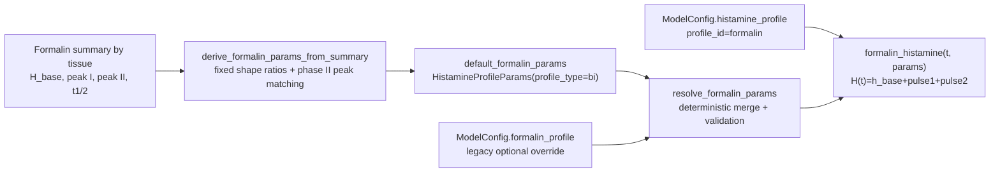

# Диаграмма параметров formalin

**Поддерживаемый путь:** `ModelConfig.histamine_profile.profile_id=formalin`. Базовые параметры formalin теперь **детерминированно выводятся** из summary-величин (`H_base`, `peak I`, `peak II`, `t1/2`) через `derive_formalin_params_from_summary`. `ModelConfig.formalin_profile` остаётся как legacy whitelist-override поверх уже выведенных параметров. **Оптимизация (least_squares) в рабочем пайплайне не используется.**

