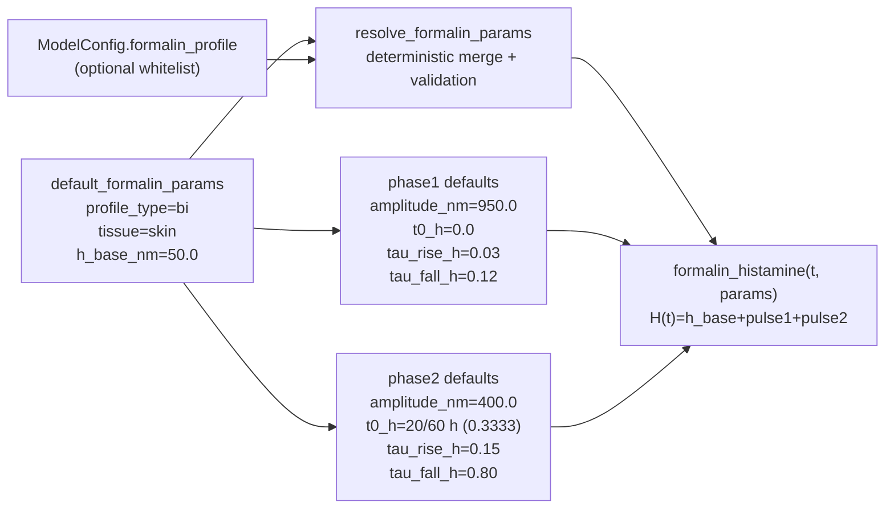

# Диаграмма параметров formalin

**Поддерживаемый путь:** фиксированные параметры из `default_formalin_params` и опциональные whitelist-override из `ModelConfig.formalin_profile` через `resolve_formalin_params` / `resolve_formalin_params_from_model_config`. **Оптимизация (least_squares) в рабочем пайплайне не используется.** Исторический пример `runs/example_fit/fitted_params.json` и программный legacy-вызов `fit_histamine_to_markers` помечены как deprecated (см. `CHANGELOG.md`).

